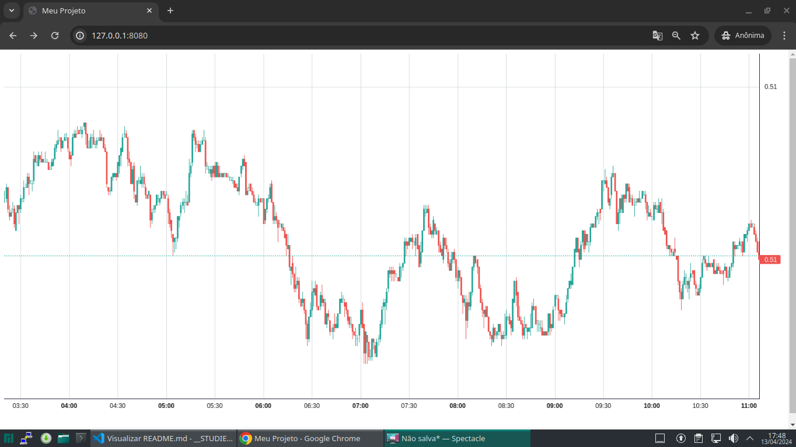

Instalar dependências
```
npm install
```

Gerar arquivos com webpack.mix
```
npm run dev
```

Iniciar servidor
```
http-server public 
```

ou tudo junto que é mais prático


```
npm run dev && http-server public
```

Resultado

